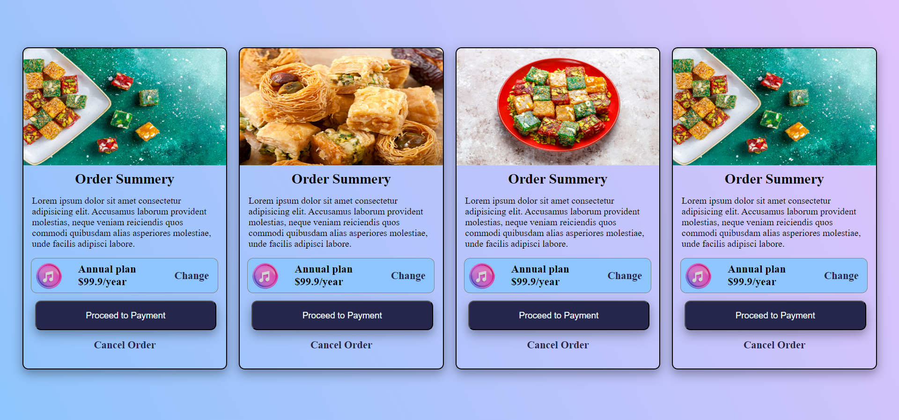

# Card Design with HTML and CSS

This project features a beautifully designed set of cards created using HTML and CSS. Each card includes an image, a summary section, pricing information, and buttons for user interaction.

## Features

- **Responsive Design**: The layout adapts well to different screen sizes using `flexbox`.
- **Elegant Styling**: Gradient backgrounds, shadow effects, and rounded corners enhance the aesthetic appeal.
- **Interactive Buttons**: Buttons change color on hover for a modern and engaging user experience.
- **Reusable Components**: Each card is modular and can be reused with minimal modifications.

## Preview



## Technologies Used

- **HTML**: For structuring the content.
- **CSS**: For styling and layout, including flexbox, gradients, and shadows.

## Files

- **index.html**: Contains the structure of the cards.
- **styles.css**: Embedded CSS for styling the design.
- **Images Folder**: Contains images used in the cards.

## Installation

1. Clone the repository:
   ```bash
   git clone https://github.com/yourusername/card-design.git
   ```
2. Navigate to the project directory:
   ```bash
   cd card-design
   ```
3. Open the `index.html` file in your browser to view the design.

## Project Structure

```
card-design/
├── index.html
├── README.md
├── styles.css
└── images/
    ├── sweet.jpg
    ├── eastern-sweets.jpg
    ├── traditional-turkish-delight-oriental-sweets.jpg
    └── music.webp
```

## How to Use

1. Replace the placeholder images (`sweet.jpg`, `eastern-sweets.jpg`, etc.) with your own images.
2. Update the card content, such as titles, descriptions, and pricing, directly in the `index.html` file.
3. Adjust the styles in the embedded CSS as per your requirements.

## Customization

- Modify the gradient colors in the `.container` class for a different background theme.
- Change the shadow effects or border styles in the `.cardBox` class for a unique card appearance.
- Adjust the hover effects on the `button` for different interaction styles.

## License

This project is open-source and available under the MIT License. Feel free to use and modify it for your own projects.

---

Enjoy designing with this card template!
